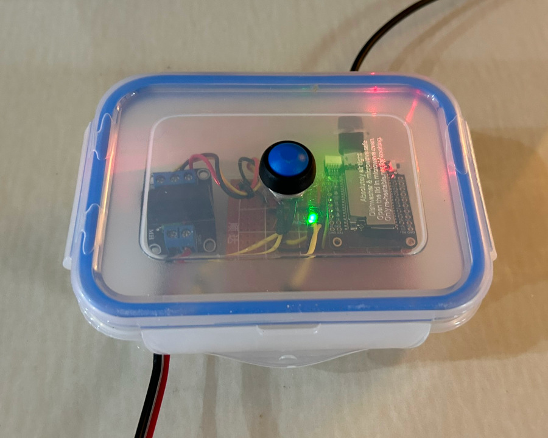
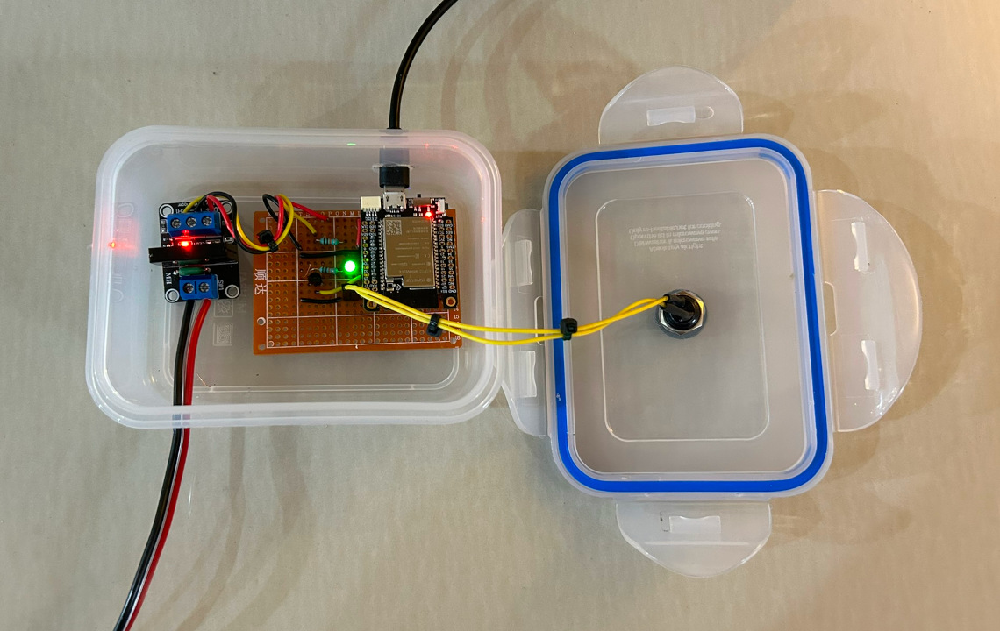
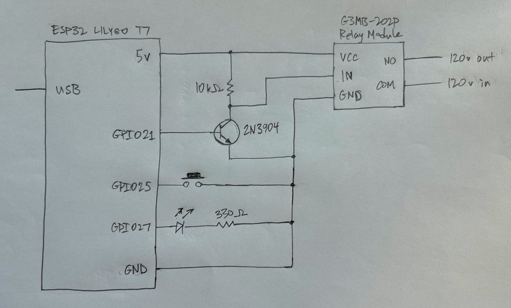

# IndySwitch

IndySwitch is a small IoT (Internet of things) device for turning a 120V AC switch on
and off at sunset and sunrise. It runs on custom hardware based on an
[ESP32](https://en.wikipedia.org/wiki/ESP32) microcontroller. The firmware is
written in C and C++, using the
[ESP-IDF](https://docs.espressif.com/projects/esp-idf/en/latest/esp32/).

## Features

An IndySwitch:

* Switches a 120v line on and off and sunset and sunrise, using a silent optocoupler relay.
* Has a push button to turn the switch on and off manually.
* Has an LED that turns on when the switch is on.
* Is flashed and and powered with a USB cable.
* Connects to wifi.
* Sets system time automatically using NTP.
* Can configured and monitored over wifi using the [IndyMqtt](https://github.com/stalexan/indy-mqtt) command-line client.
* Supports multicast DNS (mDNS), so no name server updates are needed to find device using its hostname.

## Hardware

The IndySwitch was prototyped on a
[clone](https://www.aliexpress.us/item/2251832678407407.html) of the 
[ESP32-DevKitC](https://www.espressif.com/en/products/devkits/esp32-devkitc)
It also runs on an [ESP32 LILYGO T7](https://www.lilygo.cc/products/t7-mini32-v1-5), and should
work on most ESP32 based devices. This is the finished LILYGO T7 version:

<div style="display: flex; justify-content: center; align-items: center; margin-bottom: 18px;">
   
   
</div>

The wire coming in from the lower-left is the 120v line that's switched on and
off, and wire at the top-right is the USB connection used to power and flash
the device.  Not shown is a plastic separator that sits between the relay on
the left and the main board on the right, to insulate the main board form the
120v circuitry in the relay.

### Parts

The parts that make up an IndySwitch are:

* ESP32 module: the [LILYGO T7](https://www.lilygo.cc/products/t7-mini32-v1-5).
* 120v relay switch: the [1565E G3MB-202P Optocoupler Relay Module](https://www.aliexpress.us/item/3256801435433225.html).
* Transistor to step the 3.3v ESP32 output pin up to 5v to use as input to the relay: a [2N3904](https://en.wikipedia.org/wiki/2N3904).
* 10 kΩ resistor: Limits the current that passes through the transistor.
* 3mm green LED: Shows whether the switch is on or off.
* 330 Ω resistor: Limits the current that passes through the LED.
* Momentary push button: Turns the switch on and off manually.

### Schematic

The schematic is:

<div style="display: flex; justify-content: center; align-items: center; margin-bottom: 18px;">
   
</div>

## Configuration

Configuring an IndySwitch is done in two parts. The first is for permanent
settings, that are flashed to the device and then can't be changed, and the
second is for settings that are also flashed, but can then be changed at
runtime.

### Permanent Settings

Permanents settings are made
by editing the files [`indy_config.cc`](components/indy_common/indy_config.cc)
and `indy_config_secrets.cc`, in the directory
[`components/indy_common/`](components/indy_common).

The file [`indy_config.cc`](components/indy_common/indy_config.cc) is used to configure:

* What ESP32 module to compile for. This determines which GPIO pins will be used for IO.
* The hostname of the device.
* The URL of the MQTT broker used to communicate with the optional
  [IndyMqtt](https://github.com/stalexan/indy-mqtt) client.
* The URL of the NTP server used to set the system time.

An example of these settings in [`indy_config.cc`](components/indy_common/indy_config.cc) is:

```
#define CONFIG_DEVKITC // Compile for the ESP32 DevKitC module.
const char* const HOSTNAME = "esp-vorona";
const char* const MQTT_BROKER = "mqtts://elias.alexan.org:8883";
const char* const SNTP_TIME_SERVER = "pool.ntp.org";
```

The file `indy_config_secrets.cc` holds usernames and passwords, for connecting
to wifi and the MQTT broker. An example version is:

```
#include "indy_config.h"

const char* const WIFI_SSID = "foobar";
const char* const WIFI_PASSWORD = "changeme";

const char* const MQTT_USER = "foobar";
const char* const MQTT_PASSWORD = "changeme";
```

### Changeable Settings

Changeable settings are settings that can be changed at runtime, using the
optional [IndyMqtt](https://github.com/stalexan/indy-mqtt) command-line
utility. The initial version of these are compiled into firmware and flashed to
the device using the file [`initial_config.json`](main/initial_config.json), in
the directory [`main`](main). 

The changeable settings are:

* `timezone`: Which timezone the device is in. The value of this setting is
  used to set the 's `TZ` environment variable. The format of this string is
  the same as that described in the
  [GNU C library documentation](https://www.gnu.org/software/libc/manual/html_node/TZ-Variable.html).
* `offset`: The random offset used to vary on and off times, in minutes. For
  example if sunrise is at 6:15 AM and `offset` is 60, the switch will turn on
  each morning at a random time between 5:15 AM and 7:15 AM.
* `suntimes`: Sunrise and sunset times, specified in pairs, with one pair per month. For example, 
  `"2":  ["6:46 AM", "6:20 PM"]` says that in February sunrise is at 6:46 AM and sunset is at 6:20 PM.

The default version of [`initial_config.json`](main/initial_config.json) has:

```
{
  "timezone": "CST6",
  "offset": 60,
  "suntimes": {
    "1":  ["6:53 AM", "6:03 PM"],
    "2":  ["6:46 AM", "6:20 PM"],
    "3":  ["6:26 AM", "6:29 PM"],
    "4":  ["6:02 AM", "6:36 PM"],
    "5":  ["5:45 AM", "6:45 PM"],
    "6":  ["5:43 AM", "6:56 PM"],
    "7":  ["5:51 AM", "6:58 PM"],
    "8":  ["6:01 AM", "6:45 PM"],
    "9":  ["6:07 AM", "6:20 PM"],
    "10": ["6:12 AM", "5:57 PM"],
    "11": ["6:25 AM", "5:42 PM"],
    "12": ["6:42 AM", "5:46 PM"]
  }
}
```

## Development Environment

IndySwitch is written in C and C++ using the
[ESP-IDF](https://docs.espressif.com/projects/esp-idf/en/latest/esp32/) framework.
Development was done on a Debian machine that was configured using these instructions:
[Standard Toolchain Setup for Linux and macOS](https://docs.espressif.com/projects/esp-idf/en/latest/esp32/get-started/linux-macos-setup.html).

## Building and Flashing

To build the firmware run:

```
idf.py build
```

To flash the firmware and then monitor log messages from the device, attach the
IndySwitch to the development machine with a USB cable and run:

```
idf.py flash monitor
```

## Administration and Maintenance

Once up and running an IndySwitch can be left as is without further
configuration. Or, there's an optional command-line utility that can be used to
monitor its status, turn it on and off, and make configuration changes. See
[IndyMqtt](https://github.com/stalexan/indy-mqtt).

## License

IndySwitch is licensed under the [MIT License](https://spdx.org/licenses/MIT.html).
You can find the complete text in [LICENSE](LICENSE).
